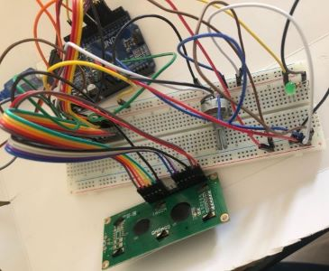

# AutoParkMonitor - Intelligent Parking System Prototype with YOLOv8, OpenCV, and Arduino Integration

This project aims to develop an intelligent parking system prototype using YOLOv8 for object detection and tracking, OpenCV for image processing, and Arduino for hardware integration. The system provides real-time object counting and tracking functionalities to manage parking spaces efficiently.

## Overview

The prototype consists of two main components: the software component, responsible for object detection and tracking using YOLOv8 and OpenCV, and the hardware component, managed by Arduino, which controls the physical output devices such as LED indicators and servo motors. The system detects and tracks vehicles in a parking lot, counts them, and provides feedback through LED indicators and an LCD display.


## Features

- Real-time vehicle detection and tracking using YOLOv8 and OpenCV
- Object counting and tracking functionalities
- Integration with Arduino for controlling physical output devices
- Feedback through LED indicators and LCD display
- Resilient to variations in lighting conditions and camera angles

## Demo Video

[Watch Demo Video](./images/demo.mp4)

## Hardware Setup

The hardware setup consists of the following components:

| Component       | Description                        |
|-----------------|------------------------------------|
| Arduino Uno     | Microcontroller board              |
| Servo Motor     | Rotary actuator                    |
| LED Indicator   | Light-emitting diode indicator     |
| LCD Display     | Liquid Crystal Display module      |
| Camera          | Webcam or Raspberry Pi Camera Module |


 | 


## Usage

1. Connect the hardware components according to the provided circuit diagram.
2. Upload the Arduino code (`auto_park_monitor.ino`) to the Arduino board.
3. Install the required Python libraries using `pip install -r requirements.txt`.
4. Run the Python script (`main.py`) to start the intelligent parking system.
5. Adjust camera positioning and line points for object counting as needed.

## Example Usage

```python
python main.py
```

## Contributors

- [emreaslan7](https://github.com/emreaslan7) - Developer
- [EnesBaki](https://github.com/EnesBaki) - Developer